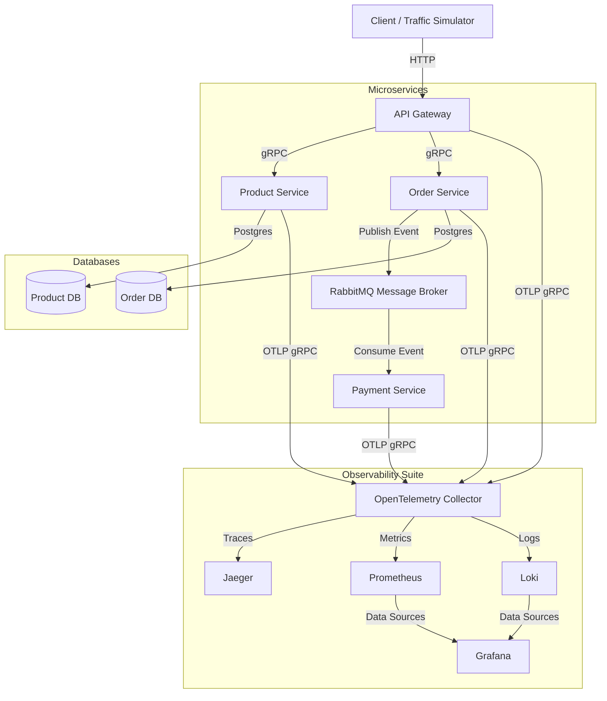

# 🚀 Resilient Go E-commerce Microservices

A high-performance, resilient, and fully instrumented Go microservices project designed as a "unicorn-level" portfolio piece. This repository features distributed transactions, async messaging, rate limiting, and a comprehensive observability stack.

---

## 🏗️ System Architecture



### Telemetry Pipeline
All services use [pkg/telemetry/telemetry.go](file:///home/barqi/barqi-repository/resilient-ecommerce-microservices/pkg/telemetry/telemetry.go) to push logs, metrics, and traces over **OTLP (gRPC)** to the unified [OpenTelemetry Collector](file:///home/barqi/barqi-repository/resilient-ecommerce-microservices/deploy/otel-collector-config.yaml). The Collector acts as a routing engine, dispatching:
* **Traces** to Jaeger
* **Metrics** to Prometheus (scraped via OTel Collector's exporter port `8889`)
* **Logs** to Grafana Loki

---

## 🛠️ Technology Stack
* **Language**: Go 1.22+
* **RPC Framework**: gRPC / Protocol Buffers
* **Event Broker**: RabbitMQ
* **Databases**: PostgreSQL (Separate databases for Order and Product services to align with microservice database-per-service pattern)
* **Observability**: OpenTelemetry, OTel Collector, Prometheus, Grafana, Loki, Jaeger
* **Deployment**: Docker & Docker Compose

---

## ⚡ Quick Start

### Prerequisites
* [Docker](https://docs.docker.com/) and [Docker Compose](https://docs.docker.com/compose/)
* `bash` and `curl` (for running the traffic simulation script)
* `make` (optional, for running Makefile shortcuts)

### 1. Spin up the Stack
To start all infrastructure services (databases, RabbitMQ, telemetry tools) and build/run the Go microservice containers, run:

```bash
make docker-up
```
*Alternatively, if `make` is not installed:*
```bash
docker-compose up -d --build
```

### 2. Verify Services are Running
Check that the containers are healthy:
```bash
docker-compose ps
```

---

## 🚦 Running Traffic & Demo Simulators

To demonstrate the microservices stack and generate telemetry data for recruiters, we have created automated traffic simulation scripts. You can choose to run a pure "happy path" simulation or a realistic "demo" simulation that injects deliberate failures for observability showcasing.

### 1. The Recruiter Demo Script (Success & Errors)
We highly recommend running the demo script. It generates a rich mix of 200 OKs, 400 Bad Requests, and 404 Not Found errors to populate your observability dashboards with diverse data.
Script: [scripts/demo_traffic.sh](file:///home/barqi/barqi-repository/resilient-ecommerce-microservices/scripts/demo_traffic.sh)

**What it does:**
1. **The Happy Path:** Creates a product, fetches it, and successfully places an order.
2. **The Error Path:** Attempts to fetch a fake product, sends a malformed JSON payload, and creates an order for a non-existent product.

**Run it:**
```bash
./scripts/demo_traffic.sh
```

### 2. The Basic Simulator (Happy Path Only)
If you only want clean, successful operational data, use the basic simulator.
Script: [scripts/simulate_traffic.sh](file:///home/barqi/barqi-repository/resilient-ecommerce-microservices/scripts/simulate_traffic.sh)

**What it does:**
It continuously loops to create products and orders successfully, fetching them immediately after creation.

**Run it:**
```bash
./scripts/simulate_traffic.sh
```

**To stop any simulation**, press `Ctrl + C` in the terminal window.

---

## 📊 Observability Dashboards

Once the traffic simulation is running, telemetry data is actively pushed to the collectors. Open your browser and navigate to the following tools:

| Tool | Description | URL | Credentials / Notes |
| :--- | :--- | :--- | :--- |
| **Jaeger** | Distributed tracing tool to visualize request flows across services, databases, and message queues. | [http://localhost:16686](http://localhost:16686) | No login required. |
| **Grafana** | Centralized telemetry dashboard showing system performance, logs, and metrics. | [http://localhost:3000](http://localhost:3000) | **User**: `admin` <br> **Password**: `admin` |
| **Prometheus** | Query raw metrics sent from the microservices. | [http://localhost:9090](http://localhost:9090) | No login required. |
| **RabbitMQ Mgmt** | Monitor the message broker queues and consumer connection states. | [http://localhost:15672](http://localhost:15672) | **User**: `guest` <br> **Password**: `guest` |

---

## 🎨 Provisioning Grafana Dashboards with Terraform

We manage Grafana configuration as code using Terraform. The [terraform/](file:///home/barqi/barqi-repository/resilient-ecommerce-microservices/terraform) folder contains resources to:
* Set up **Prometheus**, **Loki**, and **Jaeger** as Grafana Data Sources.
* Configure **Exemplars** and **Derived Fields** to correlate traces with metrics and log entries.
* Provision a pre-configured **E-Commerce Observability Dashboard** showing HTTP request rates, request latencies (p95), and aggregated logs from Loki.

### Steps to Run:
1. Make sure the Docker Compose stack is running (`make docker-up`).
2. Run the Terraform initialization (downloads required provider plugins):
   ```bash
   make tf-init
   ```
3. (Optional) Validate the configuration files:
   ```bash
   make tf-validate
   ```
4. Apply and deploy the datasources and dashboard:
   ```bash
   make tf-apply
   ```
5. Get the direct dashboard URL from the output!

*Note: The Makefile commands automatically run Terraform within a Docker container using the official HashiCorp image, so you do not need to install Terraform locally.*

---

## 🛠️ Makefile Commands Reference

The project includes a [Makefile](file:///home/barqi/barqi-repository/resilient-ecommerce-microservices/Makefile) with short commands to manage development tasks:

| Command | Description |
| :--- | :--- |
| `make proto` | Recompiles all protocol buffers ([proto/](file:///home/barqi/barqi-repository/resilient-ecommerce-microservices/proto) directory) to Go files. |
| `make build` | Builds all service binaries locally in the `bin/` directory. |
| `make docker-up` | Rebuilds and launches the entire microservices stack in detached mode. |
| `make docker-down` | Tears down the Docker stack and stops all containers. |
| `make run-infra` | Launches only the databases (`order-db`, `product-db`) and `rabbitmq` without the Go app containers (useful for running microservices locally in your IDE). |
| `make run-gateway` | Runs the API Gateway service locally. |
| `make run-order` | Runs the Order service locally. |
| `make run-payment` | Runs the Payment service locally. |
| `make run-product` | Runs the Product service locally. |
| `make test` | Runs all unit and integration tests. |
| `make clean` | Deletes compiled binaries and clean workspace files. |
| `make tf-init` | Initializes Terraform inside a Docker container. |
| `make tf-validate` | Validates Terraform configuration files syntax. |
| `make tf-plan` | Performs a Terraform dry-run plan. |
| `make tf-apply` | Deploys the Grafana dashboards and datasources via Terraform. |
| `make tf-destroy` | Tears down the provisioned Grafana dashboards and datasources. |

